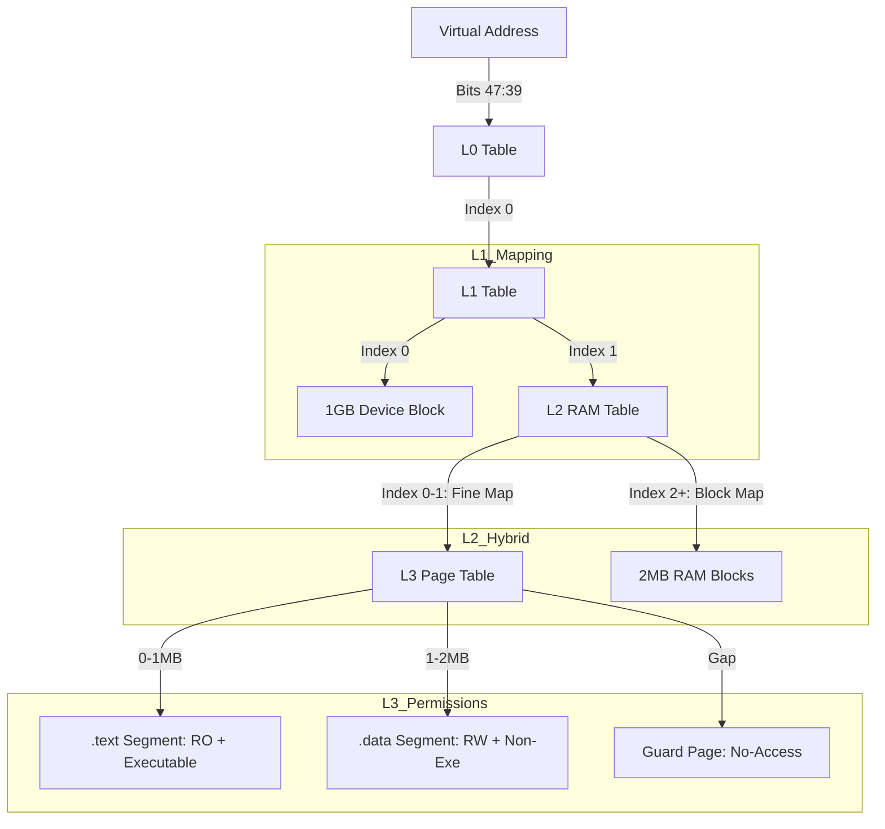

# Memory Layout & MMU Mapping Guide

Tài liệu này giải thích cách hệ điều hành quản lý bộ nhớ RAM và Thiết bị ngoại vi (Devices) trên kiến trúc ARMv8-A (QEMU Virt), tập trung vào logic "Hybrid Mapping" (Ánh xạ hỗn hợp).

## 1. Sơ đồ Bộ nhớ Vật lý (Physical Memory Layout)

Trên QEMU Virt, địa chỉ vật lý được chia làm 2 vùng lớn:

```mermaid
grid-layout
    | 0x00000000 - 0x3FFFFFFF (1GB) | 0x40000000 - Hết RAM |
    | :--- | :--- |
    | **Device Space** | **DRAM (RAM)** |
    | Chứa UART, GIC, Flash... | Chứa Code nhân, Dữ liệu, Stack... |
    | Thuộc tính: `DEVICE` (No-Cache) | Thuộc tính: `NORMAL` (Cacheable) |
```

---

## 2. Chiến lược Ánh xạ MMU (Hybrid Mapping)

Hệ điều hành sử dụng kết hợp giữa **L3 Page Mapping (4KB)** và **L2 Block Mapping (2MB)** để tối ưu giữa bảo mật và tốc độ.

### Phân ranh giới tại L1 và L2:
- **L1 Index 0:** Quản lý 1GB đầu tiên -> Map trực tiếp vào **Device Space**.
- **L1 Index 1:** Quản lý 1GB tiếp theo (Nơi RAM bắt đầu) -> Trỏ xuống **Bảng L2**.

### Cấu trúc tại L2 (Vùng RAM):
Nhân hệ điều hành (Kernel) chỉ chiếm một phần nhỏ ở đầu RAM. Hệ thống chia vùng RAM này làm 2 phần:

1.  **Vùng Bảo vệ Chi tiết (Fine-Map Region):**
    - **Phạm vi:** Từ đầu RAM đến `fine_map_end` (Tối thiểu 4MB).
    - **Cơ chế:** L2 trỏ xuống **Bảng L3** để quản lý từng trang **4KB**.
    - **Mục đích:** Đặt quyền hạn riêng cho `.text` (RO-Exe), `.data` (RW-NoExe), và `Guard Page` (bắt lỗi tràn stack).

2.  **Vùng RAM còn lại (Block-Map Region):**
    - **Phạm vi:** Từ sau vùng Kernel đến hết RAM.
    - **Cơ chế:** L2 trỏ trực tiếp vào các khối **2MB** (Block Map).
    - **Mục đích:** Tăng tốc độ dịch địa chỉ (CPU bớt phải đọc bảng L3) và tiết kiệm bộ nhớ cho bảng trang.

---

## 3. Diagram Phân tầng Bảng Trang

Dưới đây là cách CPU ARMv8 dịch một địa chỉ ảo thuộc vùng Kernel:



---

## 4. Tại sao cần Edge Case 4MB?

Nếu Kernel nặng **2.01MB**, 10KB cuối cùng sẽ bị "rơi" sang khối 2MB thứ hai.

- **Nếu map tối thiểu 2MB:** 10KB cuối đó bị gộp vào Block Map 2MB thô, mất khả năng bảo vệ chi tiết (có thể bị sai quyền Executable/Write).
- **Nếu map tối thiểu 4MB (2 chunks):** 10KB đó vẫn nằm trong vùng Fine-map của bảng L3 thứ hai, giúp nhân hệ điều hành luôn được bảo vệ toàn diện dù kích thước lẻ bao nhiêu chăng nữa.

---

*Tài liệu này được tổng hợp dựa trên file code [src/kernel/mmu_boot.c](../src/kernel/mmu_boot.c).*
