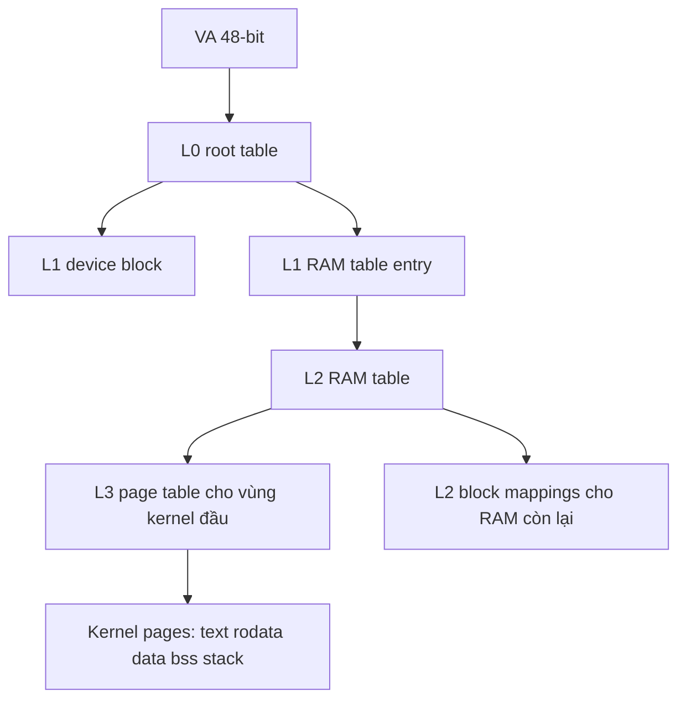
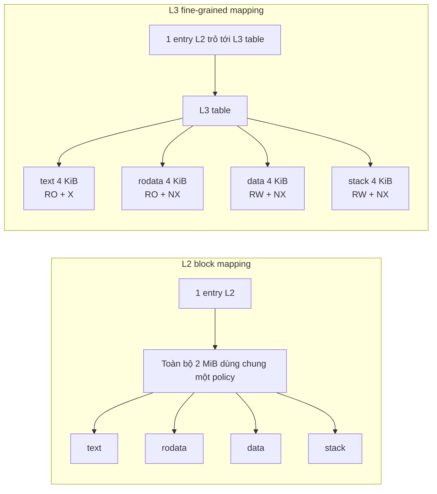

# Thiết kế MMU

## Mục tiêu

Tài liệu này mô tả thiết kế MMU hiện tại của kernel ARMv8-A trong repo này. Mục tiêu là mô tả trạng thái đang chạy thật sự, không phải thiết kế lý tưởng trong tương lai.

## Tổng quan

Hệ thống hiện tại sử dụng:

- AArch64 EL1
- `TTBR0_EL1` cho kernel identity map
- `48-bit VA`
- `4 KiB` granule
- root table tại `L0`
- hybrid mapping:
  - `L0 -> L1 -> L2 -> L3` cho tối thiểu `2` chunk đầu, mỗi chunk `2 MiB`
  - `L2` block mappings cho phần RAM còn lại

## Vì sao chọn 4-level thay vì 1, 2, hoặc 3 level

Việc chọn số level không phải là một lựa chọn thuần ý thích, mà phụ thuộc trực tiếp vào:

- số bit VA muốn hỗ trợ
- page granule đang dùng
- cách phần cứng AArch64 chia VA thành các chỉ mục bảng trang

Trong thiết kế hiện tại:

- granule là `4 KiB`
- mục tiêu là `48-bit VA`

Với tổ hợp này, phần cứng cần đủ số tầng để phân giải toàn bộ không gian địa chỉ ảo 48-bit. Vì vậy thiết kế hiện tại chọn `4-level`:

- `L0`
- `L1`
- `L2`
- `L3`

Giải thích ngắn gọn từng phương án:

### 1 level

Không phù hợp trong bối cảnh hiện tại.

- Nếu chỉ có 1 level, số entry không đủ để mô tả một không gian `48-bit VA` với granule `4 KiB` theo cách chuẩn của AArch64.
- Nó cũng không cho phép giữ được cả tính mở rộng lẫn khả năng phân quyền chi tiết như hiện tại.

### 2 level

Vẫn không phù hợp cho `48-bit VA` với `4 KiB` granule.

- 2 level có thể phù hợp hơn với không gian VA nhỏ hơn hoặc với mục tiêu mapping rất hạn chế.
- Nhưng với mục tiêu `48-bit VA`, 2 level không đủ chiều sâu để đi hết translation walk chuẩn.

### 3 level

3 level là hợp lý nếu mục tiêu VA nhỏ hơn, ví dụ mức tương đương `39-bit VA` trong cấu hình `4 KiB` granule.

- Đây chính là lý do trước đó nhánh `3-level` từng được thử nghiệm.
- Tuy nhiên khi đã chốt mục tiêu là `48-bit VA`, 3 level không còn là lựa chọn đúng về mặt kiến trúc cho không gian VA đầy đủ nữa.

### 4 level

Đây là lựa chọn đúng với mục tiêu hiện tại.

- Cho phép bao phủ `48-bit VA`.
- Giữ được khả năng tách rõ block mapping và page mapping.
- Phù hợp với hướng phát triển dài hạn như kernel virtual layout, guard pages, heap, userspace, và address spaces riêng.

Tóm lại:

- nếu chỉ muốn bring-up tối giản với VA nhỏ hơn, 3 level có thể đủ
- nhưng nếu đã xác định hướng đi là `48-bit VA`, thì 4 level là lựa chọn đúng và nhất quán hơn

## Sơ đồ bảng trang



## Mục đích của hybrid mapping

Có hai yêu cầu mâu thuẫn:

1. Cần page-level control cho kernel image để tách `.text`, `.rodata`, `.data`, `.bss`, và stack theo các quyền khác nhau.
2. Không muốn cấp phát quá nhiều bảng ngay từ đầu cho toàn bộ RAM.

Vì vậy thiết kế hiện tại chọn:

- dùng `L3` page mappings cho phần đầu RAM chứa kernel
- dùng `L2` blocks cho phần RAM còn lại để giảm overhead

## Fine-grained là gì

Trong ngữ cảnh MMU hiện tại, `fine-grained mapping` nghĩa là map bộ nhớ ở đơn vị nhỏ hơn để điều khiển chính xác hơn cách từng vùng bộ nhớ được truy cập.

Trong thiết kế này, có hai mức chính:

- `L2` block mapping: một entry đại diện cho cả `2 MiB`
- `L3` page mapping: một entry đại diện cho `4 KiB`

Vì vậy, `fine-grained` ở đây có nghĩa là:

- thay vì nói "toàn bộ vùng 2 MiB này đều giống nhau"
- ta có thể nói "mỗi page 4 KiB trong vùng 2 MiB này có thể có thuộc tính riêng"

Ví dụ thực tế trong kernel hiện tại:

- page chứa `.text` có thể `read-only + executable`
- page chứa `.rodata` có thể `read-only + non-executable`
- page chứa `.data` hoặc `.bss` có thể `read-write + non-executable`
- page stack có thể `read-write + non-executable`

Nếu chỉ dùng `L2` block mapping cho toàn bộ chunk 2 MiB chứa kernel thì ta sẽ gặp vấn đề:

- `.text`, `.rodata`, `.data`, `.bss`, stack bị ép phải dùng chung một bộ permission lớn
- rất khó giữ nguyên tắc `text executable nhưng data non-executable`
- khó thêm guard pages hoặc các vùng đặc biệt về sau

Nói ngắn gọn:

- `block mapping` tối ưu cho đơn giản và ít overhead
- `fine-grained mapping` tối ưu cho kiểm soát chi tiết và an toàn bộ nhớ

Đây là lý do hệ thống hiện tại dùng hybrid mapping:

- vùng cần kiểm soát chặt: dùng `L3`
- vùng chỉ cần RAM bình thường: giữ `L2` block

## Sơ đồ so sánh `L2 block` và `L3 fine-grained`



Ý nghĩa của sơ đồ này:

- bên trái: cả vùng `2 MiB` bị ép dùng một bộ thuộc tính lớn
- bên phải: từng page `4 KiB` có thể mang policy riêng
- đây chính là khác biệt cốt lõi giữa `block mapping` và `fine-grained mapping`

## Cấu hình control registers

### `MAIR_EL1`

- AttrIdx 0: device `nGnRnE`
- AttrIdx 1: normal memory `WBWA`

### `TCR_EL1`

Hệ thống đặt:

- `T0SZ = 16`, tương ứng `48-bit VA`
- `TG0 = 4 KiB`
- `SH0 = Inner Shareable`
- `ORGN0/IRGN0 = WBWA`
- `IPS = 48-bit`

### `SCTLR_EL1`

Kernel hiện tại bật `SCTLR_EL1.M/C/I` bằng một giá trị explicit có các bit `RES1` cần thiết. Điều này giúp tránh phụ thuộc vào reset-state của emulator.

## Cấu trúc bảng trang

### `L0`

- 1 trang table được cấp phát từ page allocator
- entry cho VA thấp trỏ tới `L1`

### `L1`

- 1 entry block cho vùng device `0x00000000`
- 1 entry table cho vùng RAM `0x40000000`

### `L2`

- quản lý các chunk `2 MiB` trong vùng RAM
- tối thiểu `2` chunk đầu trỏ tới `L3`
- các chunk còn lại là `L2` block mappings

### `L3`

- được cấp phát theo từng chunk `2 MiB` cần fine mapping
- mỗi entry là page `4 KiB`
- hiện tại áp dụng cho tối thiểu `4 MiB` đầu của vùng RAM chứa kernel image

## Layout hiện tại của kernel image

Linker đặt kernel tại `0x40080000` và xuất các symbol:

- `__text_start`, `__text_end`
- `__rodata_start`, `__rodata_end`
- `__data_start`, `__data_end`
- `__bss_start`, `__bss_end`
- `__stack_bottom`, `__stack_top`
- `__kernel_end`

MMU dùng các symbol này để quyết định permission cho mỗi page trong vùng `L3`.

## Permission model hiện tại

### `.text`

- normal memory
- read-only
- executable

### `.rodata`

- normal memory
- read-only
- non-executable

### `.data`

- normal memory
- read-write
- non-executable

### `.bss`

- normal memory
- read-write
- non-executable

### `.boot_stack`

- normal memory
- read-write
- non-executable

### RAM còn lại

- `L2` block mappings
- read-write
- non-executable

## Cấp phát bảng trang

Bảng trang được cấp phát bằng physical page allocator hiện tại.

Trong runtime hiện tại:

- 1 page cho `L0`
- 1 page cho `L1`
- 1 page cho `L2`
- thêm các page `L3` cho các chunk `2 MiB` được fine-map

Log runtime hiện tại cho thấy `mmu table pages=5` với cấu hình tối thiểu `2` chunk fine-map đã verify.

## Flow khởi tạo

Trình tự `mmu_init()` hiện tại:

1. Cấp phát `L0`, `L1`, `L2`.
2. Xây dựng mapping identity cho device và RAM.
3. Cấp phát thêm `L3` cho tối thiểu `2` chunk đầu của RAM, bao gồm vùng chứa kernel.
4. In descriptor và translation probe để debug.
5. Nạp `MAIR_EL1`, `TCR_EL1`, `TTBR0_EL1`.
6. `TLBI` + `DSB` + `ISB`.
7. Bật `SCTLR_EL1.M/C/I`.
8. Xác nhận runtime vẫn tiếp tục, sau đó timer IRQ tiếp tục chạy.

## Cách quan sát translation walk qua từng level

Trong code hiện tại, có hai cách bổ sung nhau để biết một VA được dịch như thế nào:

1. `software walk` đọc trực tiếp các descriptor đã được kernel ghi vào page tables
2. `AT S1E1R` + `PAR_EL1` hỏi phần cứng xem một VA hiện đang dịch ra kết quả gì

`Software walk` giúp trả lời câu hỏi:

- đi qua `L0`, `L1`, `L2`, `L3` nào
- walk dừng ở `L2 block` hay `L3 page`
- entry thật sự trong RAM đang chứa giá trị gì

`AT S1E1R` giúp trả lời câu hỏi:

- nếu phần cứng thực hiện stage-1 translation cho VA đó thì kết quả cuối là gì

Hai công cụ này nên đi cùng nhau:

- `software walk` để hiểu cấu trúc bảng trang
- `PAR_EL1` để kiểm tra phần cứng có đồng ý với bảng đó hay không

Trong code hiện tại, `software walk` còn có thêm hai mở rộng:

- có cờ compile-time để bật hoặc tắt toàn bộ log walk
- có decode cơ bản cho descriptor type và leaf attributes
- có API công khai để walk một VA bất kỳ từ code kernel
- có bảng target debug để gom các VA bring-up cố định vào một chỗ thay vì hardcode rải rác trong `mmu_init`
- có integration với `debug_targets` để `walk` và `PAR_EL1 probe` cùng xuất hiện như các target cùng loại trong log debug mức kernel

Khi không muốn log quá nhiều trong bring-up bình thường, chỉ cần tắt macro debug walk trong mã MMU.

API hiện tại là:

```c
void mmu_debug_walk_address(unsigned long address);
unsigned long mmu_debug_probe_address(unsigned long address);
```

Điều này hữu ích khi muốn hỏi trực tiếp:

- biến này trong `.bss` đang được map ra sao
- một page vừa lấy từ page allocator đang đi qua `L2 block` hay `L3 page`
- một địa chỉ MMIO cụ thể có đang rơi vào descriptor đúng không
- phần cứng hiện trả về `PAR_EL1` gì cho đúng địa chỉ đó

Ví dụ dùng từ kernel code:

```c
mmu_debug_walk_address((unsigned long)&boot_stage);
log_write_hex(mmu_debug_probe_address((unsigned long)&boot_stage));
mmu_debug_walk_address(0x40082000UL);
mmu_debug_walk_address(0x40400000UL);
```

Song song với API công khai, `mmu_init()` hiện cũng dùng một bảng target debug dạng tên + địa chỉ để tự động chạy `walk` và `probe` cho các VA bring-up quan trọng như `vector`, `sync`, `mmu`, `bss`, `stack`, và `block`.

Ở mức kernel-wide, module `debug_targets` hiện đã có target kind cho cả:

- page allocator range/head dumps
- MMU table pages
- MMU software walk
- MMU `PAR_EL1` probe

Điều này giúp cùng một framework debug có thể trả lời cả hai câu hỏi:

- page table path đang như thế nào
- phần cứng có dịch VA đó đúng như mong đợi không

## Ví dụ walk tay 1: VA `0x40082000`

Đây là một địa chỉ nằm trong vùng kernel đầu đang được fine-map bằng `L3`.

Các index theo công thức hiện tại là:

- `L0 index = (VA >> 39) & 0x1ff = 0`
- `L1 index = (VA >> 30) & 0x1ff = 1`
- `L2 index = (VA >> 21) & 0x1ff = 0`
- `L3 index = (VA >> 12) & 0x1ff = 130`

Vì vậy đường đi logic là:

```text
VA 0x40082000
-> L0[0]
-> L1[1]
-> L2[0]
-> L3[130]
-> page descriptor
-> PA 0x40082000
```

Ý nghĩa:

- `L0[0]` trỏ tới `L1`
- `L1[1]` trỏ tới bảng `L2` của vùng RAM bắt đầu tại `0x40000000`
- `L2[0]` không phải block, mà là table descriptor trỏ xuống `L3`
- `L3[130]` là page descriptor cuối cùng cho page `4 KiB` chứa địa chỉ này

Trong identity map hiện tại, kết quả cuối cùng là `PA = VA`, nhưng điều quan trọng hơn là walk thực sự đi đủ đến `L3`, chứ không dừng ở block mapping.

## Ví dụ walk tay 2: VA `0x40400000`

Đây là một địa chỉ cố ý chọn ở ngoài vùng fine-map tối thiểu `4 MiB`, để minh họa trường hợp walk dừng ở `L2 block`.

Các index là:

- `L0 index = 0`
- `L1 index = 1`
- `L2 index = 2`

Với địa chỉ này, đường đi là:

```text
VA 0x40400000
-> L0[0]
-> L1[1]
-> L2[2]
-> block descriptor
-> PA 0x40400000
```

Ý nghĩa:

- `L2[2]` đại diện cho cả một chunk `2 MiB`
- không có `L3` trong nhánh này
- toàn bộ vùng `0x40400000..0x405fffff` dùng chung một policy `RW + NX`

Đây là khác biệt thực tế giữa hai kiểu map trong kernel hiện tại:

- vùng kernel đầu: page-level `L3`
- RAM còn lại: coarse `L2 block`

## Cách đọc log runtime của walk

Khi bật log debug walk, bạn sẽ thấy dạng:

```text
[info] walk va=0x0000000040082000
[info] walk l0 index=0
[info] walk l0 entry=...
[info] walk l1 index=1
[info] walk l1 entry=...
[info] walk l2 index=0
[info] walk l2 entry=...
[info] walk l3 index=130
[info] walk l3 entry=...
[info] walk pa from l3 page=0x0000000040082000
```

hoặc với block mapping:

```text
[info] walk va=0x0000000040400000
[info] walk l0 index=0
[info] walk l0 entry=...
[info] walk l1 index=1
[info] walk l1 entry=...
[info] walk l2 index=2
[info] walk l2 entry=...
[info] walk pa from l2 block=0x0000000040400000
```

Nếu walk dừng ở đâu đó với log kiểu `invalid lN entry`, nghĩa là page-table path cho VA đó chưa được dựng đúng hoặc descriptor bị encode sai.

## Cách đọc log permission mới

Với bản mở rộng hiện tại, mỗi leaf entry còn in thêm một dòng dạng:

```text
[info] walk attrs: mem=normal ap=ro exec=x sh=inner af=1 section=.text
```

Ý nghĩa các trường:

- `mem=device|normal`: loại memory dựa trên `AttrIdx`
- `ap=ro|rw`: quyền đọc-ghi ở mức kernel hiện tại
- `exec=x|nx`: kernel có thể execute từ page đó hay không
- `sh=inner|non`: shareability của mapping
- `af=1|0`: access flag đã được set hay chưa
- `section=...`: vùng logic của VA đang được walk, ví dụ `.text`, `.bss`, `boot-stack`, `ram-other`

Ví dụ mong đợi:

- page `.text`: `mem=normal ap=ro exec=x`
- page `.rodata`: `mem=normal ap=ro exec=nx`
- page `.data` hoặc `.bss`: `mem=normal ap=rw exec=nx`
- RAM block thông thường: `mem=normal ap=rw exec=nx`
- MMIO block: `mem=device ap=rw exec=nx`

Nhờ có `section=...`, bạn có thể nhìn ngay một dòng log để kiểm cả hai ý:

- descriptor leaf đang áp chính sách gì
- VA đó thuộc vùng logic nào của kernel

Ngoài ra log giờ còn in thêm `walk region=...` để chỉ vùng logic mà VA đang thuộc về, ví dụ:

- `walk region=.text`
- `walk region=.bss`
- `walk region=boot-stack`
- `walk region=ram-other`
- `walk region=mmio-or-unmapped`

## Vì sao vẫn là identity map

Thiết kế hiện tại ưu tiên ổn định boot và khả năng debug. Identity map có các ưu điểm:

- dễ đối chiếu VA và PA khi debug
- dễ phân tích fault trong QEMU trace và GDB
- giảm số lượng biến động khi Stage 6 mới được khởi tạo

Đây chưa phải layout virtual memory cuối cùng của kernel.

## Kernel virtual layout là gì

`Kernel virtual layout` là cách tổ chức không gian địa chỉ ảo của kernel theo chủ đích thiết kế, thay vì để gần như toàn bộ vùng kernel dùng `VA = PA` như hiện tại.

Trong identity map hiện tại, ví dụ:

- kernel text nằm tại VA `0x40080000`
- và cũng được truy cập từ PA `0x40080000`

Điều này rất tiện cho bring-up vì khi nhìn log, GDB, hoặc QEMU trace, ta không phải dịch qua lại giữa địa chỉ ảo và vật lý.

Tuy nhiên về dài hạn, kernel thường không muốn toàn bộ layout bị ràng buộc bởi địa chỉ vật lý thật. Thay vào đó, kernel virtual layout sẽ đặt các vùng theo vai trò logic.

Ví dụ ý tưởng:

- kernel text ở một vùng VA cố định riêng, ví dụ một vùng cao hơn hoặc một vùng tách biệt rõ ràng
- kernel rodata ở vùng VA riêng
- kernel heap ở một vùng VA riêng
- kernel stacks ở các vùng VA có guard pages xung quanh
- MMIO ở một vùng VA riêng cho device mappings
- physical memory direct map ở một vùng VA riêng nếu hệ thống cần truy cập toàn bộ RAM vật lý theo cách thống nhất

Ví dụ minh họa khái niệm, không phải layout hiện tại:

- VA `0xffff000000100000` -> PA của kernel text
- VA `0xffff000001000000` -> PA của kernel heap
- VA `0xffff100000000000` -> direct map cho physical memory
- VA `0xffff200000000000` -> MMIO window

Điểm quan trọng là:

- các VA này không cần bằng PA
- kernel có thể chọn layout tối ưu cho an toàn, phân tầng, và quản lý bộ nhớ

### Identity map khác gì kernel virtual layout

Identity map toàn bộ:

- đơn giản
- dễ debug
- ít biến số trong giai đoạn đầu
- nhưng khó tách biệt rõ các vùng chức năng

Kernel virtual layout:

- cho phép tách text, rodata, data, heap, stack, MMIO thành các vùng VA độc lập
- thuận lợi cho guard pages, KASLR về sau, userspace separation, direct map, và memory debugging
- phù hợp hơn với một hệ điều hành thực thụ thay vì chỉ là kernel bring-up

### Vì sao chưa làm ngay ở Stage 6 hiện tại

Stage 6 hiện tại ưu tiên:

- bật MMU ổn định
- giữ UART, timer, IRQ, exception path hoạt động
- giảm số lượng biến động cùng lúc

Nếu vừa bật MMU vừa chuyển ngay sang một virtual layout hoàn toàn khác, số nguồn lỗi sẽ tăng mạnh:

- lỗi translation
- lỗi relocation con trỏ
- lỗi stack/exception vectors
- lỗi MMIO vì không còn dùng địa chỉ identity cũ

Vì vậy cách đi hợp lý là:

1. trước hết bật MMU ổn định với identity map
2. sau đó từng bước giới thiệu kernel virtual layout
3. cuối cùng giảm dần sự phụ thuộc vào `VA = PA`

### Bước chuyển đổi thực tế sẽ như thế nào

Một lộ trình thực dụng thường là:

1. giữ một identity map tối thiểu cho boot path
2. thêm một vùng VA riêng cho kernel text/rodata/data
3. chuyển code kernel sang chạy ổn định trong vùng VA mới
4. thêm heap/stacks/MMIO windows riêng
5. cuối cùng thu hẹp hoặc loại bỏ các identity mappings không còn cần thiết

Đó là ý nghĩa của câu “tách Stage 6 thành kernel virtual layout thay vì identity map toàn bộ”.

## Ràng buộc hiện tại

1. Chỉ dùng `TTBR0_EL1`; chưa tách vùng kernel/user theo `TTBR1_EL1`.
2. Vẫn còn identity map cho toàn bộ RAM đã quản lý.
3. Chưa có allocator riêng cho page tables ngoài physical page allocator.
4. Fine-grained `L3` mới áp dụng cho một phần đầu của RAM, chưa mở rộng ra toàn bộ các vùng cần chính sách riêng.
5. Kernel vẫn chưa có virtual layout tách biệt khỏi physical identity map.

## Hướng mở rộng tiếp theo

1. Mở rộng `L3` fine mapping cho thêm các chunk RAM cần phân quyền chi tiết.
2. Giới thiệu higher-half hoặc một kernel virtual layout tách biệt khỏi identity map.
3. Tách page-table allocator và metadata riêng cho memory management sau này.
4. Thêm guard pages và các vùng ảo chuyên biệt cho stack, heap, và MMIO.
5. Tiến tới address spaces riêng cho process ở các stage sau.