# Thiết kế MMU

## Mục tiêu

Tài liệu này mô tả thiết kế MMU hiện tại của kernel ARMv8-A trong repo này. Mục tiêu là mô tả trạng thái đang chạy thật sự và đề xuất các hướng cải thiện.

## Tổng quan

Hệ thống hiện tại sử dụng:

- AArch64 EL1
- `48-bit VA` (Virtual Address)
- `4 KiB` granule
- Root table tại `L0`
- Hybrid mapping:
  - `L0 -> L1 -> L2 -> L3` cho vùng kernel image (với granularity `4 KiB`).
  - `L2` block mappings (`2 MiB`) cho phần RAM còn lại để giảm overhead bảng trang.

Kernel chỉ hỗ trợ một kiến trúc high-VA:

- Boot dùng `TTBR0_EL1` identity map và `TTBR1_EL1` kernel VA map (`0xFFFF...`).
- Sau khi nhảy sang kernel VA, `TTBR0_EL1` được thay bằng empty root cho kernel task hoặc page table của process hiện tại cho user task.
- Chế độ kernel chạy identity-only tại PA không còn được hỗ trợ.

## Kiến trúc bảng trang 4 Tầng

Việc chọn 4 tầng (`L0` đến `L3`) là bắt buộc để hỗ trợ:

- Granule `4 KiB`.
- Không gian địa chỉ ảo `48-bit`.

Sơ đồ phân giải địa chỉ:

- `47:39`: L0 Index (512 entries)
- `38:30`: L1 Index (512 entries)
- `29:21`: L2 Index (512 entries)
- `20:12`: L3 Index (512 entries)
- `11:0`: Page Offset

## Sơ đồ bảng trang (Conceptual)

```mermaid
flowchart TD
    subgraph TTBR0["TTBR0 - Lower Half (User/Boot Identity)"]
        VA0[VA 48-bit lower half]
        L0_0[L0 root table]
        L1_0[L1 table]
        L2_0[L2 table]
        L3_0[L3 page table]
        UP[User Pages / Identity Map]

        VA0 --> L0_0
        L0_0 --> L1_0
        L1_0 --> L2_0
        L2_0 --> L3_0
        L3_0 --> UP
    end

    subgraph TTBR1["TTBR1 - Upper Half (Kernel High VA)"]
        VA1[VA 48-bit upper half 0xFFFF...]
        L0_1[t1-L0 root table]
        L1R_1[t1-L1 RAM table entry]
        L2_1[t1-L2 RAM table]
        L3_1[t1-L3 page table]
        KP_1[Kernel Segments: .text, .rodata, .data, .bss]
        RB_1[L2 block mappings for remaining RAM]

        VA1 --> L0_1
        L0_1 --> L1R_1
        L1R_1 --> L2_1
        L2_1 --> L3_1
        L3_1 --> KP_1
        L2_1 --> RB_1
    end
```

## Các tính năng chính

### 1. ASID (Address Space Identifier)

- Sử dụng để gán nhãn TLB, tránh flush toàn bộ TLB khi context switch giữa các process.
- **Cấu hình**: `TCR_EL1.A1=0` (ASID trong `TTBR0_EL1`).
- **Phân bổ**: Hỗ trợ tới 16-bit ASID (tùy phần cứng, hệ thống hiện tại quản lý qua bitmap 65536 entries). ASID 0 dành cho Kernel.
- **Hoạt động**: Các descriptor user được đánh dấu là `nG` (non-Global). Khi đổi process, kernel ghi `PA | (ASID << 48)` vào `TTBR0_EL1`.

### 2. Physical Page Reference Counting

- Mỗi trang vật lý trong managed RAM có một `ref_count` trong struct `page` (tại [src/kernel/page_alloc.c](src/kernel/page_alloc.c)).
- Cho phép quản lý vòng đời trang khi có nhiều process cùng map một trang (Shared memory, CoW).

### 3. Copy-on-Write (CoW)

- `fork()` không copy RAM ngay. Cơ chế này map các trang của tiến trình cha vào tiến trình con với quyền **Read-Only**.
- Khi một trong hai ghi vào trang, một **Permission Fault** được kích hoạt.
- Kernel kiểm tra `ref_count`:
  - Nếu `> 1`: Copy dữ liệu sang trang mới, update mapping của process gây fault thành **Read-Write**, giảm `ref_count` trang cũ.
  - Nếu `== 1`: Chỉ cần nâng cấp quyền thành **Read-Write**.

### 4. Demand Paging (Lazy Loading)

- Các vùng nhớ (Heap, Stack, ELF segments) không được map ngay vào RAM vật lý khi khởi tạo.
- Khi truy cập địa chỉ chưa map, **Translation Fault** xảy ra.
- Kernel xử lý:
  - Nếu thuộc dải hợp lệ (ví dụ: nằm trong `vm_region` của process): Cấp phát trang vật lý và map vào.
  - Nếu không: Gửi `SIGSEGV` hoặc panic (nếu là kernel).

## Các Topic có thể cải thiện

Dưới đây là các hướng phát triển để nâng cao hiệu năng và tính bảo mật của subsystem MMU:

### 1. Huge Pages (L2/L1 Block Mappings cho Userspace)

- **Vấn đề**: Việc dùng trang 4 KiB cho các buffer lớn khiến TLB bị đầy nhanh chóng.
- **Giải pháp**: Cho phép userspace yêu cầu map các block 2 MiB (L2) hoặc thậm chí 1 GiB (L1) nếu thỏa mãn điều kiện căn lề (alignment).

### 2. Swapping & Page Reclamation

- **Vấn đề**: Khi RAM vật lý hết (`page_alloc` thất bại), hệ thống sẽ crash.
- **Giải pháp**:
  - Triển khai thuật toán thay thế trang (LRU - Least Recently Used).
  - Di chuyển các trang ít dùng sang secondary storage (Disk/Flash/Ramdisk).

### 3. Bảo mật Memory (XN/PXN)

- **Execute-Never (XN)**: Đánh dấu các trang Data/Stack/Heap là không thể thực thi để chống tấn công shellcode.
- **Privileged Execute-Never (PXN)**: Đảm bảo Kernel không bao giờ vô tình thực thi code tại địa chỉ của Userspace.

### 4. Shared Memory & Zero-copy IPC

- Cho phép hai hoặc nhiều process map chung một dải trang vật lý để trao đổi dữ liệu tốc độ cao mà không cần copy qua kernel buffer.

### 5. Address Space Layout Randomization (ASLR)

- Ngẫu nhiên hóa địa chỉ base của ELF, Stack, và Heap để gây khó khăn cho kẻ tấn công khi khai thác các lỗi buffer overflow.

### 6. Fine-grained Kernel Heap Protection

- Sử dụng **Guard Pages** (trang không có quyền truy cập) kẹp giữa các allocation trong kernel heap để phát hiện lỗi heap overflow ngay lập tức.

### 7. KPTI (Kernel Page Table Isolation)

- Tách biệt hoàn toàn bảng trang của Kernel và User khi đang ở EL0 để chống lại các cuộc tấn công side-channel như Meltdown.

## Cấu hình Control Registers hiện tại

### `MAIR_EL1`

- AttrIdx 0: `Device-nGnRnE` (MMIO)
- AttrIdx 1: `Normal Memory WBWA` (RAM)

### `TCR_EL1`

- `T0SZ/T1SZ = 16` (48-bit VA)
- `TG0/TG1 = 4 KiB` granule
- `IPS = 48-bit` physical address size
- `A1 = 0` (ASID in TTBR0)
